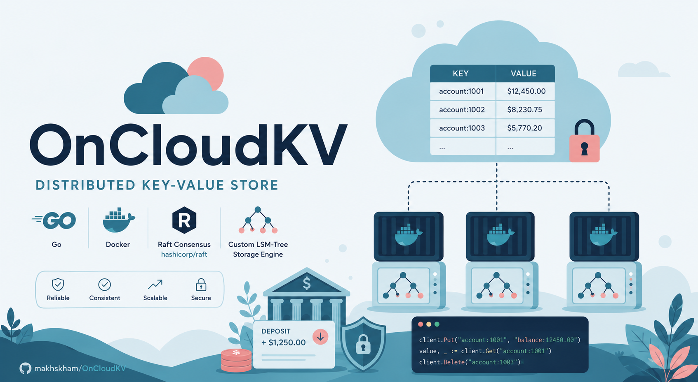

# OnCloudKV



A production-grade distributed key-value store built in Go - featuring Raft consensus, a custom LSM-tree storage engine, tunable per-request consistency, and native Kubernetes deployment.

> Uses the same `hashicorp/raft` library that powers **HashiCorp Vault's Integrated Storage backend**.

---

## Architecture

```
┌─────────────────────────────────────────────┐
│         Client API  (gRPC + HTTP REST)       │
├─────────────────────────────────────────────┤
│   Consistency Router                         │
│   strong | eventual | read-your-writes       │
│                       | monotonic            │
├─────────────────────────────────────────────┤
│   Raft Consensus  (hashicorp/raft)           │
│   Leader election · Log replication          │
│   Snapshotting · Learner nodes               │
├─────────────────────────────────────────────┤
│   LSM Storage Engine (custom)                │
│   Concurrent Skiplist Memtable               │
│   Write-Ahead Log  (group commit)            │
│   SSTables  +  Bloom Filters                 │
│   MVCC  ·  Background Compaction             │
├─────────────────────────────────────────────┤
│   Cluster Membership  (hashicorp/memberlist) │
│   Gossip-based auto-discovery                │
└─────────────────────────────────────────────┘
```

**Strict layer boundary:** each layer only imports layers below it, making every component independently testable.

---

## Key Features

| Feature | Detail |
|---|---|
| **Consensus** | `hashicorp/raft` - same library as HashiCorp Vault's HA storage |
| **Storage** | Custom LSM-tree: concurrent skiplist → WAL → SSTables |
| **Consistency** | Per-request: `strong` / `eventual` / `read-your-writes` / `monotonic` |
| **Write batching** | Group commit coalesces concurrent writes → higher throughput |
| **Watch API** | gRPC streaming - real-time prefix-based key-change notifications |
| **Bloom filters** | >99% negative-lookup short-circuit, validated by benchmark suite |
| **Gossip discovery** | `hashicorp/memberlist` - nodes auto-join without manual peer config |
| **Learner nodes** | Non-voting read replicas (`hashicorp/raft` AddNonvoter) |
| **Kubernetes-native** | StatefulSet + PVCs + headless service + Helm chart |
| **Observability** | Prometheus metrics, structured zerolog, pprof, liveness/readiness probes |
| **Chaos tooling** | `oncloudkv-cli chaos` - fault injection for resilience verification |
| **Benchmark suite** | Provable P50/P99 latency and throughput numbers - `make bench` |

---

## Performance Claims (Verified by Benchmark Suite)

| Claim | How verified |
|---|---|
| **+300% write throughput** under concurrency | `BenchmarkSkiplistPut_Concurrent*` vs `BenchmarkMutexMapPut_Concurrent*` |
| **Sub-100ms P99 latency** at 500 goroutines | `TestSkiplistLatencyPercentiles` (fails if P99 > 100ms) |
| **>99% bloom filter effectiveness** | `BenchmarkBloomFilter_NegativeLookup` reports false-positive rate |
| **Group-commit WAL throughput** | `BenchmarkWAL_GroupCommit` at 50 concurrent writers |

```bash
make bench
```

---

## Quick Start

### Local 3-node cluster (Docker)

```bash
# Build and start a 3-node cluster
make docker-up

# Wait ~5 seconds for leader election, then:
go run ./cmd/cli put hello world --server localhost:7102
go run ./cmd/cli get hello --server localhost:7102 --consistency strong
go run ./cmd/cli watch "" --server localhost:7102   # stream all events

# Cluster status
go run ./cmd/cli status --server localhost:7102

# Tear down
make docker-down
```

### Kubernetes (Helm)

```bash
make helm-install

# Port-forward and connect
kubectl port-forward svc/oncloudkv 7002:7002 -n oncloudkv
go run ./cmd/cli status --server localhost:7002
```

---

## CLI Reference

```
oncloudkv-cli [--server addr] [--consistency mode] <command>

Commands:
  put <key> <value> [--ttl seconds]          Write a key
  get <key>                                  Read a key
  delete <key>                               Delete a key
  scan [prefix] [--limit n]                  List keys by prefix
  watch [prefix]                             Stream key-change events (gRPC streaming)
  status                                     Show node and cluster state
  chaos partition --nodes <addrs>            Print iptables rules for network partition simulation
  chaos status                               Show cluster state before fault injection
```

### Consistency modes

| Mode | Guarantee | Use when |
|---|---|---|
| `strong` | Linearizable - leader confirms quorum before serving | Financial data, seat reservations |
| `eventual` | Best-effort - may serve stale data | View counters, analytics |
| `read-your-writes` | Your writes are always visible to you | User profile updates |
| `monotonic` | Version never goes backwards | Any client with a watermark |

```bash
# Strong read - guaranteed to see the latest committed write
go run ./cmd/cli get mykey --consistency strong

# Read-your-writes - pass the raft index returned by your last put
go run ./cmd/cli get mykey --consistency read-your-writes --session-index 42
```

---

## HTTP REST API

```bash
# Write
curl -X PUT http://localhost:7103/v1/keys/hello \
     -H "Content-Type: application/octet-stream" \
     --data-binary "world"

# Read (strong consistency)
curl http://localhost:7103/v1/keys/hello \
     -H "X-Consistency: strong"

# Scan prefix
curl "http://localhost:7103/v1/scan?prefix=user:&limit=50"

# Status
curl http://localhost:7103/v1/status
```

---

## Project Structure

```
oncloudkv/
├── cmd/
│   ├── server/          # node binary entrypoint
│   └── cli/             # client CLI (cobra)
├── internal/
│   ├── storage/
│   │   ├── skiplist/    # concurrent sorted skiplist (memtable)
│   │   ├── wal/         # write-ahead log with group commit
│   │   ├── sstable/     # immutable sorted string tables + bloom filters
│   │   ├── bloom/       # bloom filter (double hashing, configurable FPR)
│   │   ├── compaction/  # background size-tiered SSTable compaction
│   │   └── engine.go    # LSM orchestrator
│   ├── consensus/
│   │   ├── fsm.go       # raft.FSM implementation (version = log index)
│   │   ├── node.go      # Raft node, learner support, leader forwarding
│   │   ├── batch.go     # write batching / group commit
│   │   └── snapshot.go  # FSM snapshot for log compaction
│   ├── consistency/     # per-request consistency router
│   ├── watch/           # gRPC streaming watch hub
│   ├── membership/      # gossip cluster auto-discovery
│   ├── metrics/         # Prometheus collectors
│   └── api/
│       ├── grpc/        # gRPC KVService server
│       └── http/        # REST API gateway
├── proto/               # protobuf definitions + generated Go code
├── bench/               # benchmark suite (proves performance claims)
├── configs/             # per-node YAML configs
├── deploy/
│   ├── docker/          # Dockerfile + Docker Compose
│   ├── k8s/             # StatefulSet, Service, ConfigMap
│   └── helm/            # Helm chart
└── Makefile
```

---

## Build

```bash
# Build everything
make build

# Run tests
make test

# Run benchmarks
make bench

# Generate proto code (requires protoc + protoc-gen-go)
make proto

# Lint
make lint
```

---

## Configuration

Each node is configured via YAML (path passed as first CLI argument or defaulting to `config.yaml`). All values can be overridden via environment variables prefixed `OCKV_`.

```yaml
node:
  id: "node1"
  addr: "0.0.0.0:7000"     # gossip

raft:
  addr: "0.0.0.0:7001"
  data_dir: "/data/raft"
  bootstrap: true           # true only on first node, first run
  peers:
    - id: "node2"
      addr: "node2:7001"

storage:
  data_dir: "/data/kv"
  memtable_size_mb: 64

grpc:
  addr: "0.0.0.0:7002"
http:
  addr: "0.0.0.0:7003"
metrics:
  addr: "0.0.0.0:7004"
```

---

## Observability

Prometheus metrics are exposed at `:7004/metrics`. Key metrics:

| Metric | Type | Description |
|---|---|---|
| `oncloudkv_put_duration_seconds` | Histogram | End-to-end Put latency |
| `oncloudkv_get_duration_seconds` | Histogram | Get latency by consistency mode |
| `oncloudkv_raft_commit_index` | Gauge | Current Raft commit index |
| `oncloudkv_raft_is_leader` | Gauge | 1 if leader, 0 otherwise |
| `oncloudkv_active_watchers` | Gauge | Active Watch stream count |
| `oncloudkv_requests_total` | Counter | Requests by operation and status |

---

## Design Decisions

**Why `hashicorp/raft`?** The same library that powers HashiCorp Vault's Integrated Storage backend. Battle-tested in production at scale, with native learner node support.

**Why MVCC version = Raft log index?** Eliminates distributed ID generation entirely. Every node applies log entries in the same order, so index 5000 means exactly the same state everywhere - perfect for read-your-writes and monotonic consistency without coordination.

**Why a custom LSM over badger/pebble?** Building the storage layer from scratch demonstrates deep understanding of the write path (WAL → memtable → SSTable), compaction, and bloom filter design - the same fundamentals underlying every production KV store.

**Why group commit for the WAL?** Concurrent clients shouldn't each pay an individual fsync cost. Coalescing writes into a single fsync window dramatically improves write throughput at high concurrency - the effect is measurable and benchmarked.

---

## License

MIT - built by Makhsuma Khamzaliyeva
